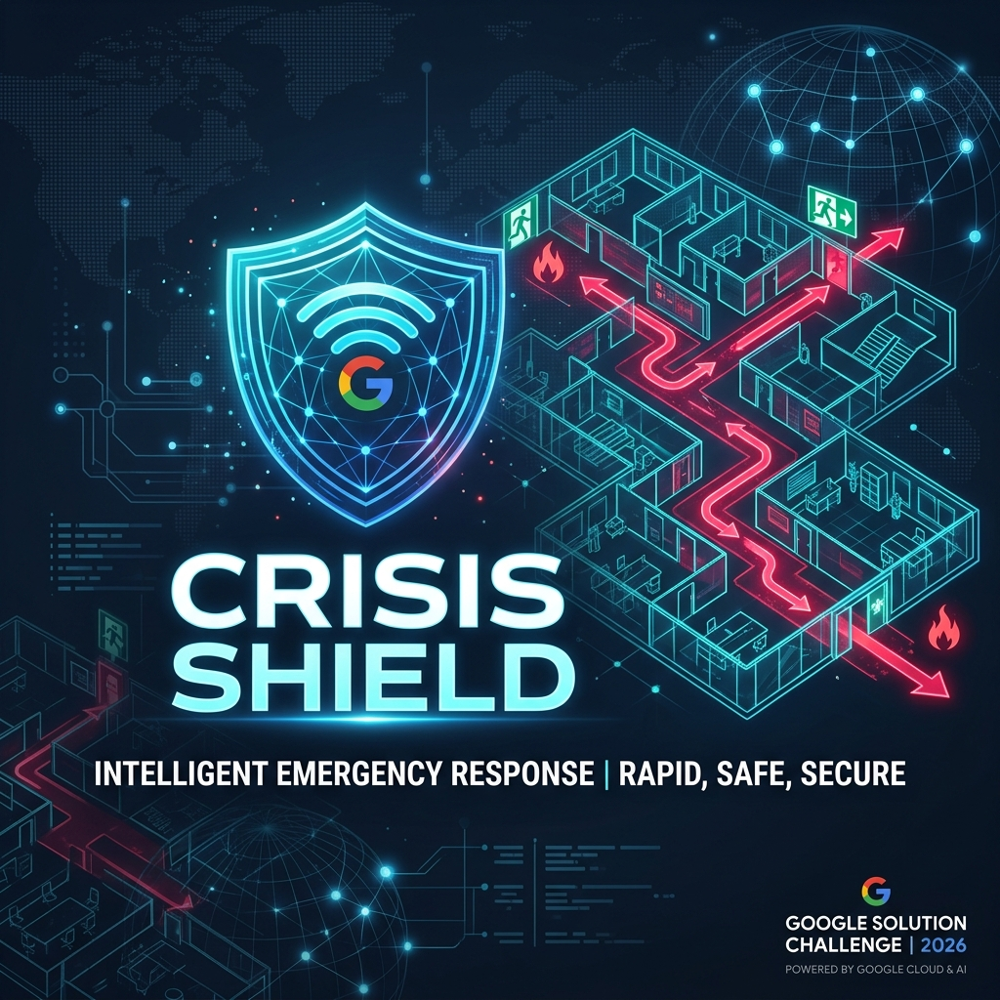
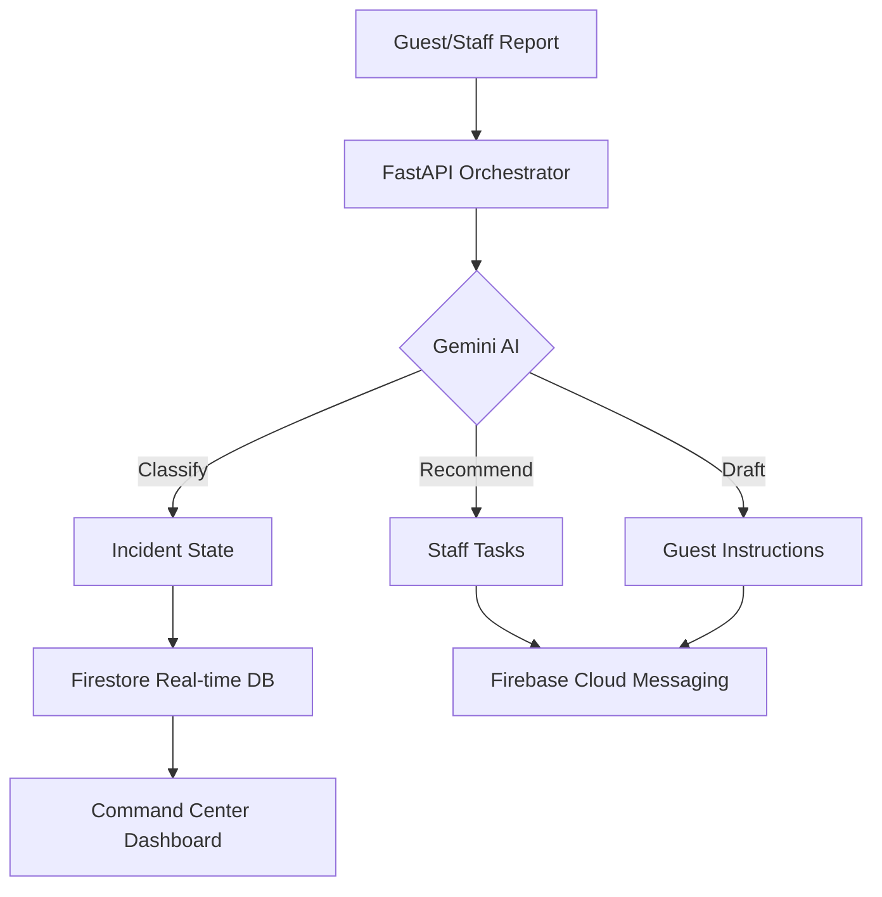

# 🚨 CrisisShield — AI-Powered Crisis Coordination

> **Revolutionizing hospitality emergency response with Google-backed multi-agent intelligence.**
> Built for the Google Solution Challenge 2026.

[](https://crisisshield.vercel.app)
[](https://crisisshield-backend.asia-south1.run.app)
[](https://cloud.google.com)

---



## 🎯 The Mission
In hospitality environments, seconds matter. **CrisisShield** eliminates chaos by orchestrating a unified, AI-driven response to fire, medical, and security threats, ensuring guest safety through real-time coordination.

---

## 🧠 Google Cloud & AI Stack
CrisisShield leverages a unified Google ecosystem for mission-critical reliability.

| Component | Technology | Usage |
|---|---|---|
| **Core AI** | **Gemini 3 Flash** | Classification, severity analysis, task recommendation, and multilingual-safe response drafting. |
| **Backend** | **Cloud Run** | Scalable, low-latency API execution for high-pressure incident orchestration. |
| **Database** | **Firestore** | Real-time state management for incidents, task timelines, and spatial data. |
| **Auth** | **Firebase Auth** | Secure, role-based identity for guests, staff, and command center admins. |
| **Messaging** | **FCM** | Instant emergency notifications and dynamic evacuation updates. |

*Engineered with **Antigravity IDE** — AI-assisted environment for rapid development.*

---

## 🛠️ Key Capabilities
- **Multi-Agent Orchestration**: Specialized agents for Classification, Routing, and Communication.
- **Dynamic Evacuation**: Real-time rerouting based on blocked exits and incident proximity.
- **Multilingual Support**: AI-powered safety instructions in the guest's native language.
- **Post-Incident Review**: Automated Gemini-summarized reports for protocol optimization.

---

## 🌍 SDG Alignment
- **SDG 11: Sustainable Cities & Communities** — Enhancing urban resilience through optimized emergency response.
- **SDG 3: Good Health & Well-Being** — Accelerating medical intervention in critical hospitality incidents.

---

## 🚀 Deployment & Setup

<details>
<summary><b>Frontend (Next.js)</b></summary>

```bash
cd frontend
npm install
npm run dev
```
</details>

<details>
<summary><b>Backend (FastAPI)</b></summary>

```bash
cd backend
pip install -r requirements.txt
uvicorn main:app --reload
```
</details>

---

## 🏗️ Architecture


---

<p align="center">
  <b>Google Solution Challenge 2026</b><br>
  <i>Safety through Intelligence.</i>
</p>
